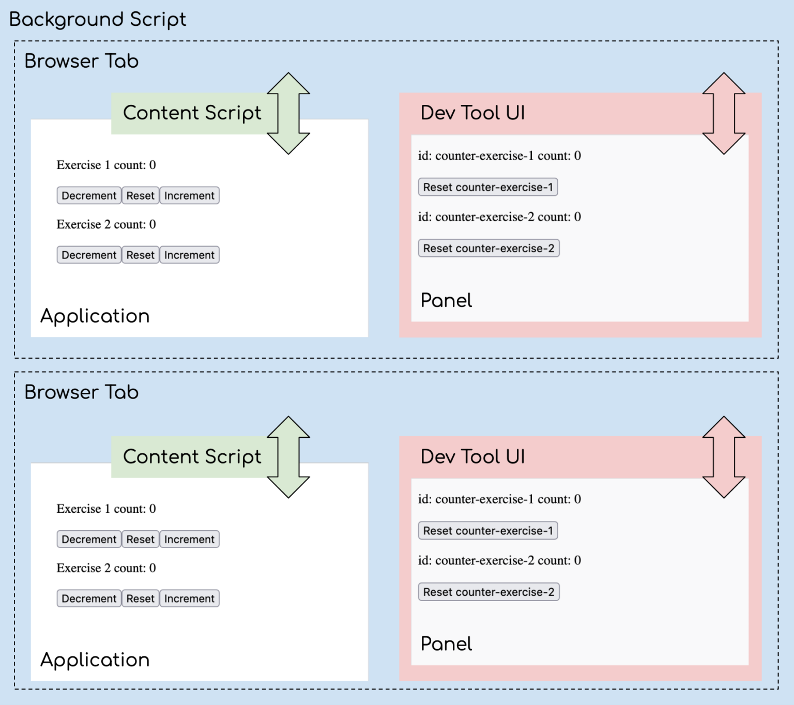

# Communication for Custom Developer Tools


_By Matthew Curtis, Senior Software Engineer_

## Background

Hey 👋 I’m Matthew and I work on a project called [Perseus](https://github.com/Khan/perseus). It’s an open-source project that’s responsible for the exercise experience at Khan Academy. If you’ve ever answered a question using the radio widget or typed in an equation using our math keypad, you’ve used Perseus!

Since Perseus is detached from our main website (aka Webapp), we can sometimes run into issues that are tough to debug—we can’t easily add logging to the Perseus code and sometimes Webapp’s dependency on Perseus’ subpackages gets out of sync. We do have an existing set of developer tooling built into Webapp, but it gets added to the DOM, which creates a disconnect between what internal users see and what our learners see.

So for a recent hackathon, I decided to prototype Perseus Dev Tools, a browser extension that added additional tooling to the browser’s built-in developer tools, inspired by [React Dev Tools](https://react.dev/learn/react-developer-tools) and [Redux Dev Tools](https://github.com/reduxjs/redux-devtools). The goal is to do the following:

- Give us an in-depth look at the exercise we are looking at in Webapp
- Compare Webapp’s Perseus dependencies with the latest versions on npm
- Give us a place to put other Khan Academy-specific developer tools
- Avoid changing the DOM so we can see what learners see

Since there weren’t a lot of examples on how to make this work, I decided to make a mock extension that shows off this functionality and write up some highlights of the code. However, this isn’t going to be a full how-to. The code is available and [MDN has written better docs than I ever could](https://developer.mozilla.org/en-US/docs/Mozilla/Add-ons/WebExtensions). This is just a high-level overview of how the pieces fit together, paired with a working example.

[Speaking of which, here’s the code for demo.](https://github.com/handeyeco/dev-tool-blog)

## The Demo


The demo site is a Create React App site that has a couple of Counter components. We want the extension to do the following:

- Show the current count state of each Counter component.
- As the state in the site changes, the state in the extension should change.
- The extension has a “reset” button that will reset a specific Counter.
- If the site is open in several tabs, the extension should not modify Counters on other tabs.

To set it up:

- cd `./application; yarn start` to start the application
- [Use this guide to temporarily install the extension.](https://developer.mozilla.org/en-US/docs/Mozilla/Add-ons/WebExtensions/Your_first_WebExtension#installing) (Firefox)

## The Structure of Dev Tool Extensions

A developer tool extension is just a specific type of browser extension. In the extension manifest, we specify a path for the dev tool UI using devtools_page, and in the JS for that UI, we create a panel using browser.devtools.panels.create. Each tab will have an instance of the UI, and the UI can have any number of panels.

My original expectation was that the application and the dev tool would be able to communicate directly, but this turned out to be incorrect. There are a handful of layers to consider, and for security reasons, these layers communicate by [posting](https://developer.mozilla.org/en-US/docs/Web/API/Window/postMessage) and listening for messages. The site has to explicitly opt in to communicating with these layers. The script injected into the application (the content script) has very limited access to the host application, but it can receive messages that the host application posts—that’s how we’ll pass around data.



These are the layers:

- The **Application** is the website we want to receive data from and send commands to.
- The **Content Script** is code that’s injected into the application. This lets us proxy messages between the application and the background script.
- The **Background Script** is code that’s running at the browser level (rather than the application level). It can coordinate messages between multiple tabs and dev tool panels.
- There’s the **Dev Tool** overall, which is capable of rendering multiple panels.
- Finally, there’s the **Panel**, which we use for the actual interface of the tool. It can send/receive messages to/from the background script.

So, to send a message from a **Panel** to the **Application**: **Panel → Background → Content → Application**. To send a message from the **Application** to the Panel: **Application → Content → Background → Panel**.

⚠️⚠️⚠️ _There’s a “Gotcha!” though. The background script is working with many tabs and many panels. We have to make sure we’re communicating with the instances of those with which we’re intending to interact._ ⚠️⚠️⚠️

## Messages

If you’ve ever worked with iFrames, you’ve likely used messages. It’s a way for sandboxed code to communicate outside of its sandbox. For each layer, we’re going to be using a system of listening for and dispatching messages.

One consideration is that other extensions may be dispatching messages. Other parts of our code may be dispatching messages. To make things easy to follow and to ensure that we’re only responding to the messages we want to be responding to, this is what our messages are going to look like:

```JS
const message = {
  extension: "blog-ext",
  source: "application",
  action: "rendered",
  data: {
    widgetId: "counter-exercise-1",
    count: 42,
  },
}
```

We’ll use `extension` to differentiate our messages from other messages, and we’ll use `source` to keep track of which layer is sending the message. `action` will be what happened, and data will be the payload.

## Sending Data from the Application

We’re going to start by sending a message from the application with some data; this means we’ll either need to control the host application (like in this example) or we can post messages from a dependency of the host application (like how React sends messages to React Dev Tools through the application that uses React).

In this case, every time we render, we’re going to send out a message that looks like this:

```JS
// application/src/Counter.js

window.postMessage({
  extension: "blog-ext",
  source: "application",
  action: "rendered",
  data: {
    widgetId: "counter-exercise-1",
    count: 42,
  },
})
```

The content script, which is injected into the web application, is going to catch it and send out its own version:

```JS
// dev-tools/scripts/content.js

/**
 * Listen to messages from the application,
 * forward them to the background script
 */
window.addEventListener("message", (event) => {
  // Only accept messages from the same frame
  if (event.source !== window) {
    return;
  }

  const message = event.data;
  // Only accept messages that we know are ours
  if (message?.extension !== "blog-ext" || message?.source !== "application") {
    return;
  }

  browser.runtime.sendMessage({
    extension: "blog-ext",
    source: "content",
    action: message.action,
    data: message.data,
  });
});
```

The background script is a little more complicated as there is only one instance of the background script that’s coordinating data for multiple tabs. It needs to keep track of each tab and multiple connections to dev tool panels. We’re also going to keep track of state so that when a panel connects, it can request the state of a specific tab.

```JS
// dev-tools/scripts/background.js

const connections = {};
const latestState = {};

/**
 * Listen to messages from the content script,
 * save data for when/if the dev tools panel connects,
 * and forward messages to the dev tools panel
 */
browser.runtime.onMessage.addListener((message, sender) => {
  // Only accept messages that we know are ours
  if (message?.extension !== "blog-ext" || message?.source !== "content") {
    return;
  }

  // Messages from content scripts should have sender.tab set
  if (sender.tab) {
    const tabId = sender.tab.id;

    // store state for when dev tool panel connects
    if (message.action === "rendered") {
      if (!latestState[tabId]) {
        latestState[tabId] = {};
      }

      latestState[tabId][message.data.widgetId] = message.data.count;
    } else if (message.action === "removed") {
      if (!latestState[tabId]) {
        return;
      }

      delete latestState[tabId][message.data.widgetId];
    }

    // foward messages
    if (tabId in connections) {
      connections[tabId].postMessage({
        extension: "blog-ext",
        source: "background",
        action: message.action,
        data: message.data,
      });
    } else {
      console.log("Tab not found in connection list.");
    }
  } else {
    console.log("sender.tab not defined.");
  }
});
```

Finally, we can receive that data in the panel code:

```JS
// dev-tools/ui/panel/panel.js

let widgets = {};

/**
 * Create a connection to the background script
 */
const backgroundPageConnection = browser.runtime.connect({
  name: "panel",
});

/**
 * Listen for messages from background script
 */
backgroundPageConnection.onMessage.addListener((request) => {
  // Only accept messages that we know are ours
  if (message?.extension !== "blog-ext" || message?.source !== "background") {
    return;
  }

  switch (request.action) {
    case "rendered":
      widgets[request.data.widgetId] = request.data.count;
      break;
    case "removed":
      delete widgets[request.data.widgetId];
      break;
    case "hydrate-state":
      widgets = { ...widgets, ...request.data };
      break;
  }

  // update panel UI
  render();
});
```

## Sending Commands from Dev Tools

Now, let’s do things in reverse. We’ll start with an “init” message to get the saved state from the background script. We’ll also send a “reset” message from the panel, but similar to the previous example, we’ll need to add some data to help this message get to the right tab.

```JS
// dev-tools/ui/panel/panel.js

/**
 * Send an init message back to background script
 * to request existing state
 */
backgroundPageConnection.postMessage(
  formatMessage({
    extension: "blog-ext",
    source: "panel",
    action: "init",
    data: {
      tabId: browser.devtools.inspectedWindow.tabId,
    },
  })
);

/**
 * Callback for UI button press
 */
function handleClickReset(widgetId) {
  backgroundPageConnection.postMessage(
    formatMessage({
      extension: "blog-ext",
      source: "panel",
      action: "reset",
      data: {
        widgetId,
        tabId: browser.devtools.inspectedWindow.tabId,
      },
    })
  );
}
```

Once again, the background script is a little more complicated. We’ll add a listener for messages from the panel, but we’ll also add a disconnect listener to clean up connections when we need to.

```JS
// dev-tools/scripts/background.js

/**
 * Listen to messages from the dev tools panel,
 * and either respond or foward them to the content script
 */
browser.runtime.onConnect.addListener((port) => {
  function extensionListener(message) {
    // Only accept messages that we know are ours
    if (message?.extension !== "blog-ext" || message?.source !== "panel") {
      return;
    }

    // Listen for the panel to connect, save a reference to it,
    // and hydrate its state
    if (message.action === "init") {
      connections[message.data.tabId] = port;
      port.postMessage({
        extension: "blog-ext",
        source: "background",
        action: "hydrate-state",
        data: latestState[message.data.tabId],
      });
      return;
    }

    // forward everything else to the content script
    browser.tabs.sendMessage(
      message.data.tabId,
      {
        extension: "blog-ext",
        source: "background",
        action: message.action,
        data: message.data,
      }
    );
  }

  // Listen to messages sent from the DevTools page
  port.onMessage.addListener(extensionListener);

  port.onDisconnect.addListener((port) => {
    port.onMessage.removeListener(extensionListener);

    var tabs = Object.keys(connections);
    for (let i = 0; i < tabs.length; i++) {
      if (connections[tabs[i]] == port) {
        delete connections[tabs[i]];
        break;
      }
    }
  });
});
```

We’ll catch forwarded messages in the content script and forward them to the application:

```JS
// dev-tools/scripts/content.js

/**
 * Listen to messages from the background script,
 * forward them to the application
 */
browser.runtime.onMessage.addListener((message) => {
  // Only accept messages that we know are ours
  if (message?.extension !== "blog-ext" || message?.source !== "background") {
    return;
  }

  window.postMessage({
    extension: "blog-ext",
    source: "content",
    action: message.action,
    data: message.data,
  });
});
```

Then, finally, we can put this all together in the Counter component:

```JS
// application/src/Counter.js

// Listen to messages from the content script
function handleMessage(event) {
  const message = event.data;

  // Only accept messages that we know are ours
  if (message?.extension !== "blog-ext" || message?.source !== "content") {
    return;
  }

  const messageWidgetId = message.data.widgetId;
  const messageAction = message.action;
  if (messageWidgetId === widgetId && messageAction === "reset") {
    onChange(0);
  }
}

useEffect(() => {
  window.postMessage({
    extension: "blog-ext",
    source: "application",
    action: "rendered",
    data: {
      widgetId,
      count,
    },
  });
  window.addEventListener("message", handleMessage);

  return () => {
    window.postMessage({
      extension: "blog-ext",
      source: "application",
      action: "removed",
      data: {
        widgetId,
      },
    });
    window.removeEventListener("message", handleMessage);
  };
});
```

## Conclusion

So, that’s it! Some of this code is a little verbose, and some of the checks are being overly cautious, but hopefully this helps show how the layers are interacting with one another. Thanks for reading!

Sources:

- [MDN: Extend the developer tools](https://developer.mozilla.org/en-US/docs/Mozilla/Add-ons/WebExtensions/Extending_the_developer_tools)
- [Chrome for Developers: Extending DevTools](https://developer.chrome.com/docs/extensions/how-to/devtools/extend-devtools)
